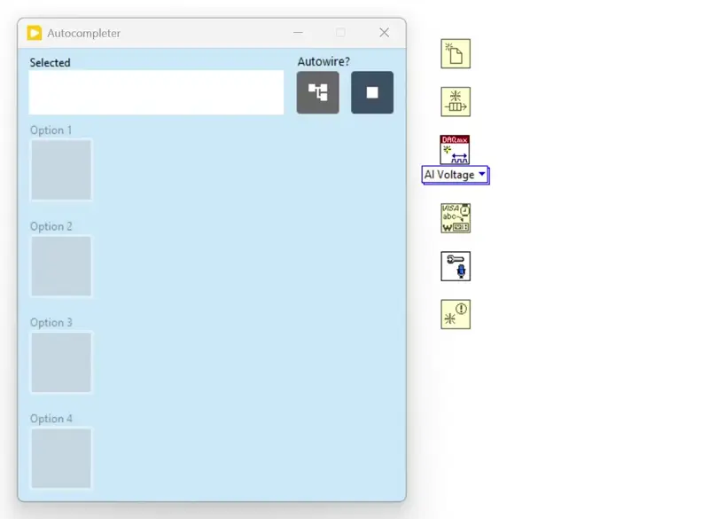

# DMC-Complete: Autocomplete for LabVIEW

## What is DMC-Complete?
DMC-Complete is a tool for LabVIEW users that suggests your next block for you while you program. Simply select on a block on your block diagram and instantly receive suggestions for the next block to use and drop it with a single-click.

⚡ Blazing fast – predictions in a fraction of a second

💻 Runs entirely on device – no internet needed

💾 Tiny footprint on your disk, CPU, and RAM

🧩 Supports all your custom libraries

🤝 Completely open source under the BSD 3-Clause License

## How does it work?
Under the hood, DMC-Complete uses a Markov chain model trained on code you provide it to build a key-value map of the form:

List of "parent blocks" -> List of subsequent blocks and how often they appear afterwards

When you select a block, it checks the map and provides suggestions to you in decreasing order of occurrences in the training data. This approach to next-block prediction is uniquely suited to LabVIEW where variables don't have names and code is easy to represent graphically.

### Can I build my own ML pipeline with this?
In the indexing and autocompletion process, there is a `MarkovModel` class that is given training data and later used to predict subsequent blocks. It inherits from the `AbstractModel` class, which defines the core interface for training and prediction.

To implement your own pipeline:
- Create a new class that extends `AbstractModel`.
- Implement the required methods (e.g., `Train`, `Predict`).
- Point the indexer and autocompleter to use your model instead of `MarkovModel`.

This allows you to experiment with alternative ML approaches while still using the same indexing and autocompletion infrastructure.

## How do I start using it?

### Installation
__NOTE: The source code for this project has been saved with LabVIEW 2024.__
1. Install the [SQLite Library by JDP Science](https://www.vipm.io/package/drjdpowell_lib_sqlite_labview/) using VIPM
2. [Download](https://github.com/fadilf/DMC-Complete/archive/refs/heads/main.zip) and extract the code or clone the repo to an install location of your choice.
3. Open `DMC-Complete.lvproj`
4. From the Project Explorer view, run `Indexer.vi`
    1. Click "Load Example Paths" to use the example files for your version of LabVIEW and examples for your installed libraries.
    2. Add any folders of code you'd like to train on in addition.
    3. Click "Run Training" and wait for the process to complete. If you need to stop the process early, you can click the stop button in the top right corner and cleanly end the process. Repeating the previous steps should let you pick up where you left off in training.
    4. Click the stop button to close the indexer.

### Usage
1. Open up the Block Diagram editor for a file you would like to work in.
2. Run the `Autocompleter.vi` file inside the repo.
3. Use the suggestions that appear when you click on a block to help you code!

#### Bonus: QuickDrop Integration (Optional, early beta)
1. Open `<LabVIEW Dir>\resource\dialog\QuickDrop`
2. Rename `Convert QD Object String to 2D Array.vi` to `Convert QD Object String to 2D Array - Backup.vi`
3. Rename `QuickDrop Process Drop Information.vi` to `QuickDrop Process Drop Information - Backup.vi`
4. Copy the files from `DMC-Complete\QuickDrop` into `<LabVIEW Dir>\resource\dialog\QuickDrop` and open them to make sure that load dependencies correctly.
5. Run `Autocompleter.vi` and suggestions should start appearing in QuickDrop.

## Can I contribute?
Absolutely! There are many ways for you to help out from raising an issue for bugs you've spotted or features you'd like to making a pull request with code that addresses open issues. To learn more, check out the [`CONTRIBUTING.md`](CONTRIBUTING.md) guide.
